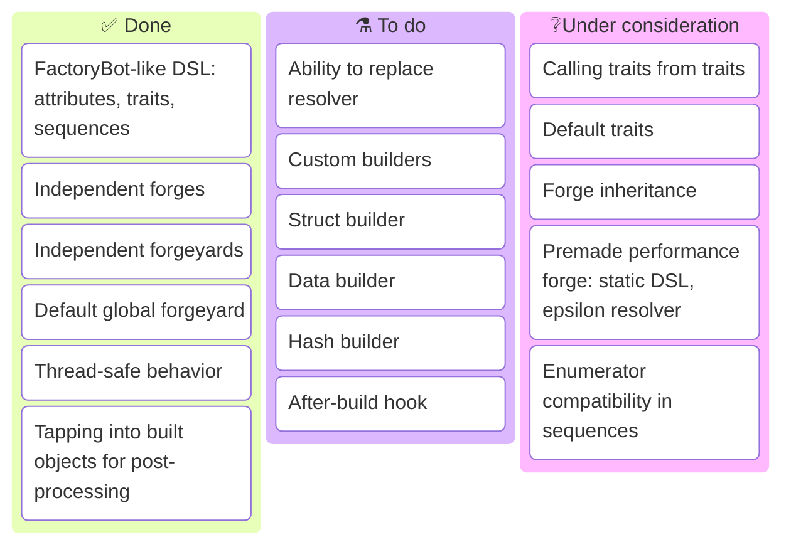

# ObjectForge

> [!TIP]
> You may be viewing documentation for an older (or newer) version of the gem than intended. Look at [Changelog](https://github.com/trinistr/object_forge/blob/main/CHANGELOG.md) to see all versions, including unreleased changes.

Latest: [](https://rubygems.org/gems/object_forge)
[](https://github.com/trinistr/object_forge/actions/workflows/CI.yaml)

***

`ObjectForge` provides a familiar way to build objects in any context with minimal assumptions about usage environment.
- It is not connected to any framework and, indeed, has nothing to do with a database.
- To use, just define some factories and call them wherever you need, be it in tests, console, or application code.
- If you need, almost any part of the process can be easily replaced with a custom solution.

## Motivation (why *another* another factory gem?)

There are a bunch of gems that provide object generation functionality, chief among them [FactoryBot](https://github.com/thoughtbot/factory_bot) and [Fabrication](https://fabricationgem.org/).
However, such gems make a lot of assumptions about why, how and what for they will be used, making them complicated and, at the same time, severely limited. Such assumptions commonly are:
- assuming that every Ruby project is a Rails project;
- assuming that "generating objects" equates "saving records to database";
- assuming that objects are mutable and provide attribute writers;
- assuming that streamlined object generation is only useful for testing;
- (related to the previous point) assuming that there will never be a need to
  have more than one configuration of a library in the same project
  (I believe this anti-pattern was popularised by Rails);
- assuming that adding global methods or objects is a good idea.

I notice that there is also a problem of thinking that Rails's "convention-over-configuration" approach is always appropriate, but then making configuration convoluted, instead of making it easy for the user to do the things they want in the way they want in the first place.

There are some projects that tried to address these issues, like [Progenitor](https://github.com/pavlos/progenitor) (the closest to ObjectForge) and [Workbench](https://github.com/leadtune/workbench), but they still didn't manage to go around the pitfalls.
Most factory projects are also quite dead, having not been updated in *many* years.

## Installation

Install with `gem`:
```sh
gem install object_forge
```

Or, if using Bundler, add to your Gemfile:
```ruby
gem "object_forge"
```

## Usage

### Basics

In the simplest cases, `ObjectForge` can be used much like other factory libraries, with definitions living in a global object (`ObjectForge::DEFAULT_YARD`).

Forges are defined using a DSL:
```ruby
# Example class:
class Point
  attr_reader :id, :x, :y

  def initialize(params)
    @id, @x, @y = params.values_at(:id, :x, :y)
  end
end

ObjectForge.define(:point, Point) do |f|
  # Attributes can be defined using `#attribute` method:
  f.attribute(:x) do
    # Inside attribute definitions, other attributes can be referenced by name, in any order!
    rand(-delta..delta)
  end
  # `#[]` is an alias of `#attribute`:
  f[:y] { rand(-delta..delta) }
  # There is also the familiar shortcut using `method_missing`:
  f.delta { 0.5 * amplitude }
  # Notice how transient attributes don't require any special syntax:
  f.amplitude { 1 }
  # `#sequence` defines a sequenced attribute (starting with 1 by default):
  f.sequence(:id, "a")
  # Traits allow to group and reuse related values:
  f.trait :z do
    f.amplitude { 0 }
    # Sequence values are forge-global, but traits can redefine blocks:
    f.sequence(:id) { |id| "Z_#{id}" }  
  end
  # Trait's block can receive DSL object as a parameter:
  f.trait :invalid do |tf|
    tf.y { Float::NAN }
    # `#[]` method inside attribute definition can be used to reference attributes:
    tf.id { self[:x] }
  end
end
```

A forge builds objects using class's `.new`, passing all attributes as a single hash. Forge can be called through any of `#[]`, `#forge`, or `#build` methods (they are aliases):
```ruby
ObjectForge[:point]
  # => #<Point:0x00007f6109dcad40 @id="a", @x=0.17176955469852973, @y=0.3423901951181103>
# Positional arguments define used traits:
ObjectForge.build(:point, :z)
  # => #<Point:0x00007f61099e7980 @id="Z_b", @x=0.0, @y=0.0>
# Attributes can be overridden with keyword arguments:
ObjectForge.forge(:point, x: 10)
  # => #<Point:0x00007f6109aabf88 @id="c", @x=10, @y=-0.3458802496120402>
# Traits and overrides are combined in the given order:
ObjectForge[:point, :z, :invalid, id: "NaN"]
  # => #<Point:0x00007f6109b82e48 @id="NaN", @x=0.0, @y=NaN>
# A Proc override behaves the same as an attribute definition:
ObjectForge[:point, :z, x: -> { rand(100..200) + delta }]
  # => #<Point:0x00007f6109932418 @id="Z_d", @x=135.0, @y=0.0>
# A block can be passed to do something with the created object:
ObjectForge[:point, :z] { puts "#{_1.id}: #{_1.x},#{_1.y}" }
  # outputs "Z_e: 0.0,0.0"
```

### Separate forgeyards and forges

It is possible to create multiple forgeyards, each with its own set of forges:
```ruby
forgeyard = ObjectForge::Forgeyard.new
forgeyard.define(:point, Point) do |f|
  f.sequence(:id, "a")
  f.x { rand(-radius..radius) }
  f.y { rand(-radius..radius) }
  f.radius { 0.5 }
  f.trait :z do f.radius { 0 } end
end
```

Now, this forgeyard can be used just like the default one:
```ruby
forgeyard[:point, :z, id: "0"]
  # => #<Point:0x00007f6109b719e0 @id="0", @x=0, @y=0>
```

Note how the forge isn't registered in the default forgeyard:
```ruby
ObjectForge[:point]
  # ArgumentError: unknown forge: point
```

If you find it more convenient not to use a forgeyard (for example, if you only need a single forge for your service), you can create individual forges:
```ruby
forge = ObjectForge::Forge.define(Point) do |f|
  f.sequence(:id, "a")
  f.x { rand(-radius..radius) }
  f.y { rand(-radius..radius) }
  f.radius { 0.5 }
  f.trait :z do f.radius { 0 } end
end
forge[:z, id: "0"]
  # => #<Point:0x00007f6109b719e0 @id="0", @x=0, @y=0>
```

`Forge` has the same building interface as a `Forgeyard`, but it doesn't have the name argument:
```ruby
forge[]
  # => #<Point:0x00007f610deae578 @id="a", @x=0.3317733939650964, @y=-0.1363936629550252>
forge[:z]
  # => #<Point:0x00007f61099f6520 @id="b", @x=0, @y=0>
forge[radius: 500]
  # => #<Point:0x00007f6109960048 @id="c", @x=-141, @y=109>
```

### Differences and limitations (compared to FactoryBot)

If you are used to FactoryBot, be aware that there are quite a few differences in specifics.

General:
- The user (you) is responsible for loading forge definitions, there are no search paths. If `ObjectForge` is used in tests, it should be enough to add something like `Dir["spec/forges/**/*.rb].each { require _1 }` to your `spec_helper.rb` (or `rails_helper.rb`).
- `Forgeyard.define` *is* the forge definition block, you don't need to nest it inside another `factory` block.
- There is no forge inheritance or nesting, though it may be added in the future.

Forge definition:
- Class specification for a forge is non-optional, there is no assumption about the class name.
- If DSL block declares a block argument, `self` context is not changed, so DSL methods can't be called with an implicit receiver.

Attributes:
- For now, transient attributes have no difference to regular ones, they just aren't set in the final object.
- *There are no associations*. If nested objects are required, they should be created and set in the block for the attribute.

Traits:
- Traits can't be defined inside of other traits. (I feel that nesting is needlessly confusing.)
- Traits can't be called from other traits. This may change in the future.
- There are no default traits.

Sequences:
- There is no way to define shared sequences, unless you pass the same object yourself to multiple `sequence` calls.
- Sequences work with values implementing `#succ`, not `#next`, expressly prohibiting `Enumerator`. This may be relaxed in the future.

## Current and planned features (roadmap)



## Development

After checking out the repo, run `bundle` to install dependencies. Then, run `rake spec` to run the tests, `rake rubocop` to lint code and check style compliance, `rake rbs` to validate signatures or just `rake` to do everything above. There is also `rake steep` to check typing, and `rake docs` to generate YARD documentation.

You can also run `bin/console` for an interactive prompt that will allow you to experiment, or `bin/benchmark` to run a benchmark script and generate a StackProf flamegraph.

To install this gem onto your local machine, run `rake install`. To release a new version, run `rake version:{major|minor|patch}`, and then run `rake release`, which will push git commits and the created tag, and push the `.gem` file to [rubygems.org](https://rubygems.org).

Checklist for a new or updated feature:
- Tests cover the behavior and its interactions.
- Running `rspec` reports 100% coverage (unless it's impossible to achieve in one run).
- Running `rubocop` reports no offenses.
- Running `rake steep` reports no new warnings or errors.
- Documentation is up-to-date: generate it with `rake docs` and read it.
- `CHANGELOG.md` lists the change if it has impact on users.
- `README.md` is updated if the feature should be visible there (especially the Kanban board).

## Contributing

Bug reports and pull requests are welcome on GitHub at https://github.com/trinistr/object_forge.

## License

The gem is available as open source under the terms of the [MIT License](https://opensource.org/licenses/MIT).
