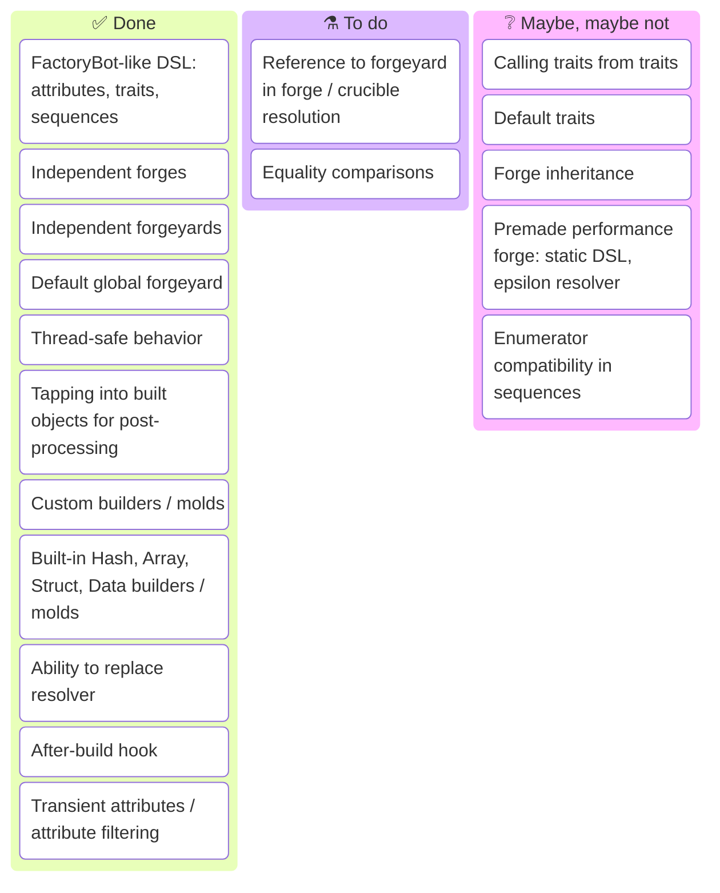

# ObjectForge

[](https://rubygems.org/gems/object_forge)
[](https://github.com/trinistr/object_forge/actions/workflows/CI.yaml)

> [!TIP]
>
> You may be viewing documentation for an older (or newer) version of the gem than intended. Look at [Changelog](https://github.com/trinistr/object_forge/blob/main/CHANGELOG.md) to see all versions, including unreleased changes.

---

**ObjectForge** is a small factory library for Ruby objects with minimal assumptions about framework, persistence, or runtime environment.

It is designed for cases where factory-style object construction is useful, but Rails-oriented or database-oriented tooling is a poor fit. **ObjectForge** works well with plain Ruby objects, hashes, arrays, structs, and custom build flows.

The library focuses on:

- explicit configuration over hidden conventions
- support for independent registries and standalone factories
- replaceable components based on simple interfaces
- usefulness both outside of tests and inside them

If you need factory-style object generation without coupling it to Rails, ActiveRecord, or a particular application structure, **ObjectForge** might be for you.

## Table of contents

- [Motivation](#motivation)
- [Installation](#installation)
- [Usage](#usage)
    - [Quick start](#quick-start)
    - [Basics](#basics)
    - [Independent forgeyards and forges](#independent-forgeyards-and-forges)
    - [Defining final attribute list](#defining-final-attribute-list)
    - [Molds: configuring object construction](#molds-configuring-object-construction)
    - [After-build customization](#after-build-customization)
    - [Performance tips](#performance-tips)
- [Differences and limitations (compared to FactoryBot)](#differences-and-limitations-compared-to-factorybot)
- [Current and planned features (roadmap)](#current-and-planned-features-roadmap)
- [Development](#development)
- [Contributing](#contributing)
- [License](#license)

## Motivation

Ruby already has well-known factory libraries, especially FactoryBot and Fabrication. Those tools are effective in many projects, particularly when working in Rails applications and persistence-oriented test setups.

**ObjectForge** aims at a different problem space: building objects with a factory-style workflow while making as few assumptions as possible about framework, storage, object lifecycle, or application structure.

**ObjectForge** is particularly useful when:

- the objects being built are plain Ruby objects rather than database-backed records
- object generation is needed outside of tests, such as in services, scripts, or fixtures
- multiple independent sets of factories need to coexist in the same project
- construction behavior should be explicit and configurable rather than hidden behind framework conventions

The project is intentionally small in scope. Rather than trying to model every style of factory workflow, it focuses on a compact, understandable core:

- a DSL for defining attributes, sequences, and traits
- forges (factories) and forgeyards (registries)
- several object molds (constructors)
- a couple other helper components

The goal is to have a simple, composable tool that you can easily reach for when heavier libraries don't fit or feel like overkill.

## Installation

Install with `gem`:

```sh
gem install object_forge
```

Or, if using Bundler, add to your Gemfile:

```ruby
gem "object_forge"
```

and run `bundle install`.

## Usage

> [!Note]
>
> - Latest documentation from `main` branch is automatically deployed to [GitHub Pages](https://trinistr.github.io/object_forge).
> - Documentation for published versions is available on [RubyDoc](https://rubydoc.info/gems/object_forge).

### Quick start

Create your domain logic class:

```ruby
class Rectangle
  def initialize(length:, width:)
    @length = length
    @width = width
  end

  def area = @length * @width

  def inspect = "[#{@length}x#{@width}]"
end
```

Define a forge:

```ruby
require "object_forge"

ObjectForge.define(:rectangle, Rectangle) do |f|
  f.mold = ObjectForge::Molds::KeywordsMold.new

  f.length { rand(1..100) }
  f.width { rand(1..100) }

  f.trait :square do |t|
    t.width { length }
  end
end
```

Forge some objects!

```ruby
ObjectForge.forge(:rectangle) # => [63x27]
ObjectForge.forge(:rectangle, :square) # => [56x56]
ObjectForge.forge(:rectangle, width: 3333) # => [79x3333]
ObjectForge.forge(:rectangle, :square, length: 123) # => [123x123]
```

### Basics

In the simplest cases, **ObjectForge** can be used much like other factory libraries, with definitions living in a global object (`ObjectForge::DEFAULT_YARD`). In this case, methods are called directly on `ObjectForge` module.

Forges are defined using a DSL:

```ruby
# Example class:
Point = Struct.new(:id, :x, :y)

ObjectForge.define(:point, Point) do |f|
  # Attributes can be defined using `#attribute` method:
  f.attribute(:x) do
    # Inside attribute definitions, other attributes can be referenced by name, in any order!
    rand(-delta..delta)
  end
  # `#[]` is an alias of `#attribute`:
  f[:y] { rand(-delta..delta) }
  # There is also the familiar shortcut using `method_missing`:
  f.delta { 0.5 * amplitude }
  # Depending on the class, transient attributes may need to be explicitly marked:
  f.transient(:amplitude) { 1 }
  # `#sequence` defines a sequenced attribute (starting with 1 by default):
  f.sequence(:id, "a")
  # Traits allow to group and reuse related values:
  f.trait :z do
    f.amplitude { 0 }
    # Sequence values are forge-global, but traits can redefine blocks:
    f.sequence(:id) { |id| "Z_#{id}" }  
  end
  # Trait's block can receive DSL object as a parameter:
  f.trait :invalid do |tf|
    tf.y { Float::NAN }
    # `#[]` method inside attribute definition can be used to reference attributes:
    tf.id { self[:x] }
  end
end
```

A forge builds objects, using attributes hash:

```ruby
ObjectForge.call(:point)
  # => #<struct Point id="a", x=0.17176955469852973, y=0.3423901951181103>
# Positional arguments define used traits:
ObjectForge.build(:point, :z)
  # => #<struct Point id="Z_b", x=0.0, y=0.0>
# Attributes can be overridden with keyword arguments:
ObjectForge.forge(:point, x: 10)
  # => #<struct Point id="c", x=10, y=-0.3458802496120402>
# Traits and overrides are combined in the given order:
ObjectForge.call(:point, :z, :invalid, id: "NaN")
  # => #<struct Point id="NaN", x=0.0, y=NaN>
# A Proc override behaves the same as an attribute definition:
ObjectForge.call(:point, :z, x: -> { rand(100..200) + delta })
  # => #<struct Point id="Z_d", x=135.0, y=0.0>
# A block can be passed to do something with the created object:
ObjectForge.call(:point, :z) { puts "#{_1.id}: #{_1.x},#{_1.y}" }
  # outputs "Z_e: 0.0,0.0"
```

> [!TIP]
>
> Forging can be done through any of `#call`, `#forge`, or `#build` methods, they are aliases.

### Independent forgeyards and forges

It is possible and *encouraged* to create multiple forgeyards, each with its own set of forges:

```ruby
forgeyard = ObjectForge::Forgeyard.new
forgeyard.define(:dot, Point) do |f|
  f.sequence(:id, "a")
  f.x { rand(-radius..radius) }
  f.y { rand(-radius..radius) }
  f.radius { 0.5 }
  f.trait :z do f.radius { 0 } end
end
```

Now, this forgeyard can be used just like the default one:

```ruby
forgeyard.forge(:dot, :z, id: "0")
  # => #<struct Point id="0", x=0, y=0>
```

Note how the forge isn't registered in the default forgeyard:

```ruby
ObjectForge.forge(:dot)
  # KeyError: key not found
```

If you find it more convenient not to use a forgeyard (for example, if you only need a single forge for your service), you can create individual forges:

```ruby
forge = ObjectForge::Forge.define(Point) do |f|
  f.sequence(:id, "a")
  f.x { rand(-radius..radius) }
  f.y { rand(-radius..radius) }
  f.radius { 0.5 }
  f.trait :z do f.radius { 0 } end
end
```

**Forge** has the same building interface as a **Forgeyard**, but it doesn't have the name argument:

```ruby
forge.build
  # => #<struct Point id="a", x=0.3317733939650964, y=-0.1363936629550252>
forge.forge(:z)
  # => #<struct Point id="b", x=0, y=0>
forge.(radius: 500)
  # => #<struct Point id="c", x=-141, y=109>
```

### Defining final attribute list

Depending on what you are forging and the [mold](#molds-configuring-object-construction) used, you may need to limit the attributes that are passed to the forged instance. This can be done by using either `transient` attributes or the `attribute_list` option in the forge definition. Both options are equivalent in the end, so the choice is yours.

#### Transient attributes

Transient attributes can be defined using the `transient` method or `transient: true` argument. This automatically sets up attribute list to exclude the attribute, but otherwise doesn't change the behavior.

```ruby
# Note that this forge is forging a Hash, not a Struct.
ObjectForge.define(:point, Hash) do |f|
  # Transient "radius" is excluded from final attribute list:
  f.transient(:radius) { 0.5 }
  # Sequences can be transient too:
  f.sequence(:s, transient: true) { |s| s * 30 }

  f.x { s + rand(-radius..radius) }
  f.y { s + rand(-radius..radius) }
end

ObjectForge.forge(:point)
  # => {x: 30.092699961573118, y: 29.71344463733288}
```

#### Attribute list

`transient` attributes are really just a convenient shortcut to specifying `attribute_list` option. Manually setting the list can be handy if uniform attribute definitions are desired, it is semantically meaningful to allowlist attributes rather than deny individually, or transient attributes don't appear in the definition. `attribute_list` can also be useful to define attribute ordering.

```ruby
ObjectForge.define(:point, Hash) do |f|
  f.attribute_list = %i[x y z]
  # Parameters:
  f.unit { :m } # Meters by default
  f.conversion { { mm: 10.0**0, m: 10.0**3, km: 10.0**6 } } # Conversion multipliers table
  # Final attribute calculations:  
  f.x { position[0] * conversion[unit] }
  f.z { position[1] * conversion[unit] }
  f.y { altitude * conversion[unit] }
end

# Note how `y` comes out as the second attribute, not the third:
ObjectForge.forge(:point, position: [10, 13.4], altitude: 5)
  # => {x: 10000.0, y: 5000.0, z: 13400.0}
ObjectForge.forge(:point, position: [10, 13.4], altitude: 5, unit: :mm)
  # => {x: 10.0, y: 5.0, z: 13.4}
```

> [!NOTE]
>
> `attribute_list` and `transient` attributes can be used in the same definition. However, transient attributes *can't* appear in attribute list; this will raise an error.

### Molds: configuring object construction

If you use core Ruby data containers, such as `Struct`, `Data` or even `Hash`, they will "just work". However, if a custom class is used, forging will probably fail, unless your class happens to take a hash of attributes in `#initialize`. It would be against the goal of **ObjectForge** to place requirements on your classes, and indeed there is a solution.

Whenever you need to change how your objects are built, you specify a *mold*. Molds are just `call`able objects (including `Proc`s!) with specific arguments. They are set in forge definition:

```ruby
forge = ObjectForge::Forge.define(Point) do |f|
  f.mold = ->(forge_target:, attributes:, **) do
    forge_target.new(attributes[:id], attributes[:x].round(3), attributes[:y].round(3))
  end
  #... rest of the definition from the Basics example
end
```

Now the specified **mold** will be called to build your objects:

```ruby
forge.forge
  # => #<struct Point id="a", x=0.331, y=-0.136>
```

Of course, you can abuse this to your heart's content. Look at the documentation for `ObjectForge::Molds` for inspiration.

> [!NOTE]
>
> If you don't specify a mold, **ObjectForge** will infer one for core data containers including **Hash**, **Array**, **Struct**, and **Data** subclasses.

**ObjectForge** comes pre-equipped with a selection of molds for common cases:

- `ObjectForge::Molds::SingleArgumentMold` (*the default*) calls `new(attributes)`, suitable for **ActiveModel**-style objects and **Dry::Struct**, as an example.
- `ObjectForge::Molds::KeywordsMold` calls `new(**attributes)`, suitable for **Data** and similar classes.
- `ObjectForge::Molds::StructMold` handles all possible cases of `keyword_init` for **Struct**s.
- `ObjectForge::Molds::HashMold` allows building **Hash** (including subclasses), including setting `default` and `default_proc` values.
- `ObjectForge::Molds::ArrayMold` allows building **Array** (including subclasses), based on attribute ordering.

You can also set a Class with a `#call` method as a mold. It will be instantiated on every call, providing a clean mold object.

> [!TIP]
>
> It is recommended to use mold instances. Using classes causes memory churn and lowers performance. Not only that, but having a stateful mold is a code smell.

### After-build customization

If there is a need to modify the object or perform additional actions after it is forged, there are two mechanisms you can employ:

- after-forge hook
- customization block

After-forge hook is a `call`able object specified as part of forge definition. It runs every time forging happens:

```ruby
forge = ObjectForge::Forge.define(Rectangle) do |f|
  # can also be specified as `after_build`
  f.after_forge = ->(rect) { puts "Used #{rect.area} sq. units" }
  #... rest of the definition from the Quick start example
end
forge.forge
  # Used 621 sq. units
  # => [23x27]
```

Customization block is an optional block argument to `#forge` and is only executed in that specific invocation:

```ruby
forge.forge { |rect| RectangleRepository.save(rect); puts "persisted!" }
  # Used 621 sq. units
  # persisted!
  # => [23x27]
```

> [!NOTE]
>
> If both hook and block are used, the hook runs before the block. 

### Performance tips

**ObjectForge** is pretty fast for what it is. However, if you are worried, there are certain things that can be done to make it faster.

- Calling a **Forge** directly, instead of through **Forgeyard**, is faster due to not needing argument forwarding. This is consistent (but check on your system anyway!).
- Using `self[:name]` instead of plain `name` inside attribute definitions does not engage dynamic method dispatch, which *should* be faster. However, micro-benchmarking does not show conclusive results.

## Differences and limitations (compared to FactoryBot)

If you are used to FactoryBot, be aware that there are quite a few differences in specifics.

General:

- The user (you) is responsible for loading forge definitions, there are no search paths. If **ObjectForge** is used in tests, it should be enough to add something like `Dir["spec/forges/**/*.rb].each { require _1 }` to your `spec_helper.rb` (or `rails_helper.rb`).
- `Forgeyard.define` *is* the forge definition block, there is no separate `factory` block.

Forge definition:

- Class specification for a forge is non-optional, there is no assumption about the class name.
- If the DSL block declares a block argument, `self` context is not changed, and DSL methods can't be called with an implicit receiver.
- There is no forge inheritance or nesting.

Attributes:

- *There are no associations*. If nested objects are required, they should be created and set in the block for the attribute.

Traits:

- Traits can't be defined inside of other traits.
- Traits can't be called from other traits. This may change in the future.
- There are no default traits.

Sequences:

- There is no explicit way to define shared sequences, but a freestanding `Sequence` can be created manually and passed into `sequence` calls.
- Sequences work with values implementing `#succ`, not `#next`, expressly prohibiting `Enumerator`. This may be relaxed in the future.

## Current and planned features (roadmap)


```mermaid
kanban
  [✅ Done]
    [FactoryBot-like DSL: attributes, traits, sequences]
    [Independent forges]
    [Independent forgeyards]
    [Default global forgeyard]
    [Thread-safe behavior]
    [Tapping into built objects for post-processing]
    [Custom builders / molds]
    [Built-in Hash, Array, Struct, Data builders / molds]
    [Ability to replace resolver]
    [After-build hook]
    [Transient attributes / attribute filtering]
  [⚗️ To do]
    [Reference to forgeyard in forge / crucible resolution]
    [Equality comparisons]
  [❔ Maybe, maybe not]
    [Calling traits from traits]
    [Default traits]
    [Forge inheritance]
    [Premade performance forge: static DSL, epsilon resolver]
    [Enumerator compatibility in sequences]
```

## Development

After checking out the repo, run `bundle install` to install dependencies. If you will be running typing checks (RBS/Steep), also execute `rbs collection install`.

Then, run `rake spec` to run the tests, `rake rubocop` to lint code and check style compliance, `rake rbs` to validate signatures or just `rake` to do everything above. There is also `rake steep` to check typing, and `rake docs` to generate YARD documentation.

You can also run `bin/console` for an interactive prompt that will allow you to experiment, or `bin/benchmark` to run a benchmark script and generate a StackProf flamegraph.

To install this gem onto your local machine, run `rake install`. To release a new version, run `rake version:{major|minor|patch}`, and then run `rake release`, which will push git commits and the created tag, and push the `.gem` file to [rubygems.org](https://rubygems.org).

## Contributing

Bug reports and pull requests are welcome on GitHub at https://github.com/trinistr/object_forge.

**Checklist for a new or updated feature**

- Running `rake spec` reports 100% coverage (unless it's impossible to achieve in one run).
- Running `rake rubocop` reports no offenses.
- Running `rake steep` reports no new warnings or errors.
- Tests cover the behavior and its interactions. 100% coverage *is not enough*, as it does not guarantee that all code paths are tested.
- Documentation is up-to-date: generate it with `rake docs` and read it.
- "*CHANGELOG.md*" lists the change if it has impact on users.
- "*README.md*" is updated if the feature should be visible there, including the Kanban board.

## License

The gem is available as open source under the terms of the [MIT License](https://opensource.org/licenses/MIT), see [LICENSE.txt](https://github.com/trinistr/object_forge/blob/main/LICENSE.txt).